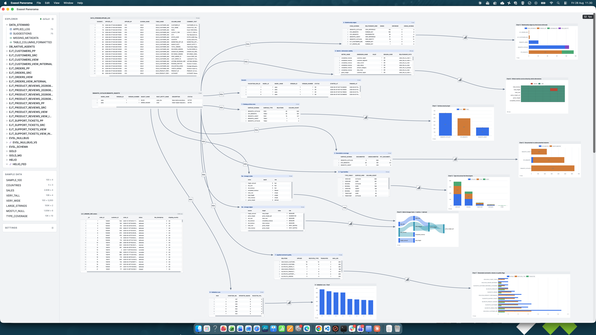

<div align="center">


# Exasol Panorama

**A spatial canvas for exploring data in Exasol.**

Tables, queries and charts as boxes on an infinite plane, drawn by the GPU,
connected by lines that mean something.

[](https://github.com/exasol-labs/exasol-panorama/actions/workflows/verify.yml)
[](LICENSE)
[](https://nodejs.org)

<a href="docs/screenshot.png"></a>

<sub>One canvas. Every box is a real result set; every arrow is where it came from.</sub>

</div>

---

## Why a canvas

A query console answers one question at a time and throws the previous answer
away. A notebook remembers, but it remembers in a line — and exploration is not a
line. You open a table, notice something odd in one column, follow a key to find
out what it points at, compare it against last year, back up two steps and try the
other branch. What you want when you are done is not the last result. It is the six
results side by side, and the arrows between them.

Panorama makes every answer a **thing**: a box on an infinite plane you can move,
resize, label and point at. A table is a box. A statement written against it is a
box beside it, with an arrow saying where it came from. A chart is a box, and
picking a mark inside it filters the boxes downstream. Follow a foreign key in a
cell and the matching rows open next to you, joined by a line. Nothing you have
learnt disappears because you asked the next question.

Two properties make that hold up against a real warehouse rather than a demo.

**It stays local-feeling at any size.** Nothing is ever held whole — not a result
set, not an export, not a chart's input. Rows are windowed, prefetched in the
direction you are already scrolling, and cached against a byte budget, so a
ten-billion-row relation flings under the pointer like a local file. One sentence
sets almost every boundary in the codebase:

> The database may cause data to arrive late. It may never cause Panorama to
> respond late.

A cell that has not arrived yet is drawn as _absent_ — never as blank, never as
zero.

**History is a graph, not an undo stack.** Every persistent change is a commit.
Move the head back to an earlier state, keep working, and you branch rather than
destroy: the line of inquiry you walked away from is still there to return to.

## What you can do

- **Open anything.** Browse schemas and tables in the explorer tree and click one
  to put it on the canvas.
- **Scroll, fling, resize.** Row and column virtualisation with smooth
  wheel and trackpad scrolling; resize tables and columns, reorder and hide them.
- **Read a column.** Click a header for nulls, distinct counts, top values or a
  histogram — and for a number column its min, max, sum, mean and standard
  deviation — in a panel under the table.
- **Follow a key.** A followable cell opens the rows it points at as a new,
  connected box.
- **Write SQL in place.** A statement box built on another box — and you keep both,
  and everything downstream re-runs.
- **Chart it.** Bar, line, area, scatter, pie, stacked — hoverable and selectable
  mark by mark. Open the rows behind whatever you picked, or let that selection
  cross-filter the boxes built on it.
- **Take it with you.** Charts export as SVG, PNG or PDF; result sets export to
  CSV, XLSX or Parquet — encoded off the main thread, streamed to disk, with
  progress and cancellation.
- **Work with an agent on the same canvas.** Not an export or a screenshot pipe:
  the same document, edited live. [How →](docs/AGENTS.md)
- **Wear it.** In a headset it enters WebXR on the same scene, with the same
  renderer.

## Two hands on one document

Panorama offers its **live session** to an agent over the Model Context Protocol —
not an export, a screenshot pipe or a replica. **There is no second copy of the
document.** An agent's edits are the same commands your pointer produces, applied
to the session in the open page: they appear on screen as they are made, they undo
like yours, and they land in the same history graph.

So you never describe your canvas to it, and you never wait for a hand-off. It
opens boxes, labels them and wires them together while you watch — and if you
disagree with one, you drag it somewhere else, close it, or check out the commit
before it. Pairing is one button: **Settings → Pair with Claude**.

[Setting it up, and what the agent is told →](docs/AGENTS.md)

## Getting it

The desktop application is the one to want: it has a window of its own, it carries
its own agent endpoint, and it is the only Panorama that can reach a database whose
certificate the machine signed itself.

Grab the `.dmg`, installer or `.deb` from the
[latest release](https://github.com/exasol-labs/exasol-panorama/releases). The
builds are currently **unsigned**, so macOS wants the first launch to come from the
right-click menu and Windows warns once.

Or run it from source — Node ≥ 20.11, and nothing else:

```bash
npm install
npm run dev            # http://localhost:5173
```

Building the application yourself, and everything else about working on it, is
[DEVELOPING.md](docs/DEVELOPING.md).

## Connecting to your data

Three ways in, in the order most people need them:

- **Exasol Personal.** If it is installed, the connection panel opens on a list of
  what it manages — here or in a cloud — with whether each one is running. Click
  one and you are connected: the address, user and password come from the
  deployment itself.
- **Anything else.** Fill in the form: `wss://host:8563`, a user and password, or
  an Exasol SaaS personal access token.
- **Before the page opens.** Environment variables set the connection ahead of
  time, which is what a headset wants.

A database on your own machine presents a certificate it signed itself. **The
desktop application handles that**; a browser cannot, and says so unhelpfully. That,
the deployment list in detail, and the startup variables are all in
**[CONNECTING.md](docs/CONNECTING.md)**.

## Known limits

Worth knowing before you judge something a bug:

- **WebGPU is preferred and does not yet work anywhere it has been tried.** Every
  renderer screenshot here is WebGL. The first engine that offered WebGPU — macOS
  WKWebView — refused the glyph texture on the first frame, and the renderer fell
  back as designed. A graphics bug to chase, not a mystery.
- **Typography, colour and the _feel_ of scrolling need a human at a real
  display.** Everything about them is verified structurally, which is not the same
  as looking good.
- **A browser install cannot reach a self-signed instance**, and **a deployed PWA
  has no agent.** Both are the desktop application's job.
- **On Windows, two Personal deployments claiming one address stay refused** —
  telling them apart needs the process table, and `lsof` has no one-line Windows
  equivalent.
- **The desktop application has not been driven by a test.** The suite and the
  probes cover the web build, which is all of the application; nothing yet launches
  the bundle and checks that it opened, drew, and could read a table.

## Documentation

| Doc                                         | What is in it                                                                                |
| ------------------------------------------- | -------------------------------------------------------------------------------------------- |
| **[CONNECTING.md](docs/CONNECTING.md)**     | Exasol Personal, self-signed certificates, connection details at startup                     |
| **[DEVELOPING.md](docs/DEVELOPING.md)**     | Running from source, the commands, packaging, releasing, headsets                            |
| **[AGENTS.md](docs/AGENTS.md)**             | Connecting an agent, in the app and in development, and what to do when it cannot see a tool |
| **[AGENT-SKILL.md](docs/AGENT-SKILL.md)**   | What the agent is told — the page the server itself serves                                   |
| **[ARCHITECTURE.md](docs/ARCHITECTURE.md)** | How it is built and why: the model, the layering, the flows, a decision record               |
| **[TESTING.md](docs/TESTING.md)**           | How we know it works: the suite, the doubles, the coverage gate, the probes                  |

MIT licensed — see [LICENSE](LICENSE).
